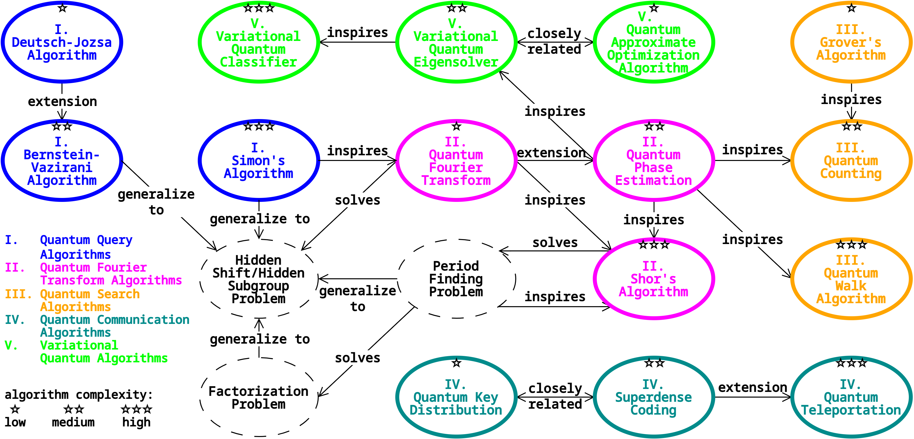

# Q-gen Quantum Circuit Generator

Please see our preprint at:  

arXiv link here

Also see our [Wiki](https://github.com/yikaimao/Q_gen/wiki) page for an overview of the simple circuits inside the Q-gen quantum circuit dataset.

## Available Algorithms



**Quantum Query Algorithms:**  
 - Deutsch-Jozsa Algorithm  
 - Bernstein-Vazirani Algorithm  
 - Simon's Algorithm  

**Quantum Search Algorithms:**  
 - Grover's Algorithm  
 - Quantum Counting Algorithm  
 - Quantum Walk Algorithm  

**Quantum Fourier Transform Algorithms:**  
 - Quantum Fourier Transform  
 - Quantum Phase Estimation  
 - Shor's Algorithm  

**Quantum Communication Algorithms:**  
 - Quantum Key Distribution  
 - Quantum Teleportation  
 - Superdense Coding  

**Variational Quantum Algorithms:**  
 - Quantum Approximate Optimization Algorithm  
 - Variational Quantum Eigensolver  
 - Variational Quantum Classifier

```
Dependencies:
    numpy
    qiskit 0.46.0
    qiskit-aer-gpu 0.13.3
    networkx
```

## Acknowledgements

We thank the community for sharing many algorithm implementations and learning resources:

 - [Qiskit](https://github.com/Qiskit/qiskit)
 - [Qiskit Textbook](https://github.com/Qiskit/textbook) (deprecated)
 - [Qiskit Algorithms](https://github.com/qiskit-community/qiskit-algorithms)
 - [Qiskit Machine Learning](https://github.com/qiskit-community/qiskit-machine-learning)
 - [ShorAlgQiskit](https://github.com/ttlion/ShorAlgQiskit) by Rui Maia and Tiago Leão

## License

[MIT License](LICENSE.txt)
