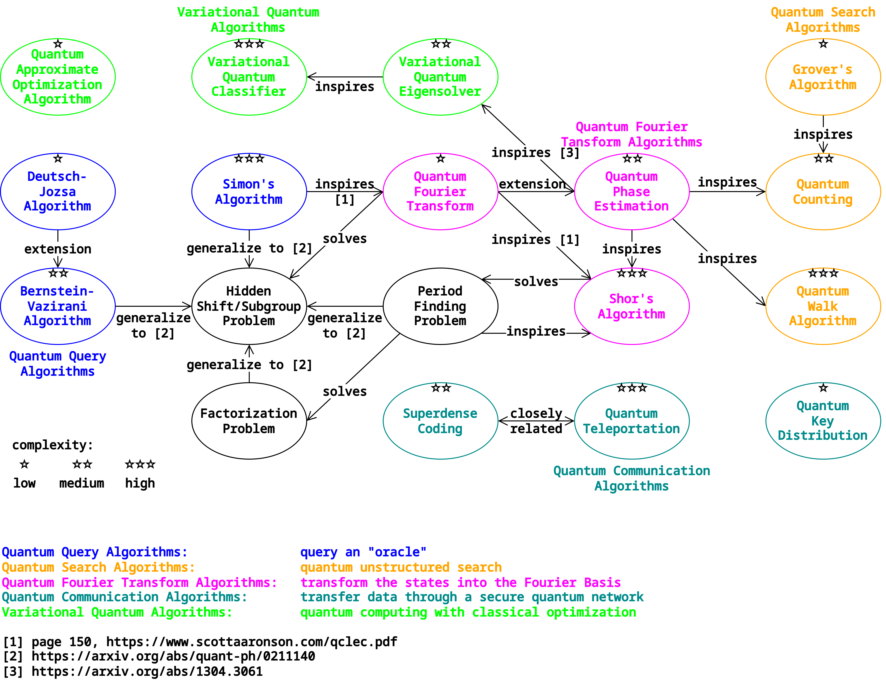

# Random Quantum Circuit Generator

Under construction...

    Dependencies:
        numpy
        qiskit 0.46.0
        qiskit-aer-gpu 0.13.3
        networkx

## Algorithms

**Quantum Query Algorithms:**  
 - Deutsch-Jozsa Algorithm  
 - Bernstein-Vazirani Algorithm  
 - Simon's Algorithm  

**Quantum Search Algorithms:**  
 - Grover's Algorithm  
 - Quantum Counting Algorithm  
 - Quantum Walk Algorithm  

**Quantum Fourier Transform Algorithms:**  
 - Quantum Fourier Transform  
 - Quantum Phase Estimation  
 - Shor's Algorithm  

**Quantum Communication Algorithms:**  
 - Quantum Key Distribution  
 - Quantum Teleportation  
 - Superdense Coding  

**Variational Quantum Algorithms:**  
 - Quantum Approximate Optimization Algorithm  
 - Variational Quantum Eigensolver  
 - Variational Quantum Classifier  

## Acknowledgements

Most of the work is based on the (now deprecated) [Qiskit Textbook](https://github.com/Qiskit/textbook).

The implementation of generalized Shor's Algorithm is based on [ShorAlgQiskit](https://github.com/ttlion/ShorAlgQiskit) by Rui Maia and Tiago Leão.

This project is also inspired by code from [Qiskit](https://github.com/Qiskit/qiskit), [Qiskit Algorithms](https://github.com/qiskit-community/qiskit-algorithms), and [Qiskit Machine Learning](https://github.com/qiskit-community/qiskit-machine-learning).

## License

[MIT License](LICENSE.txt)