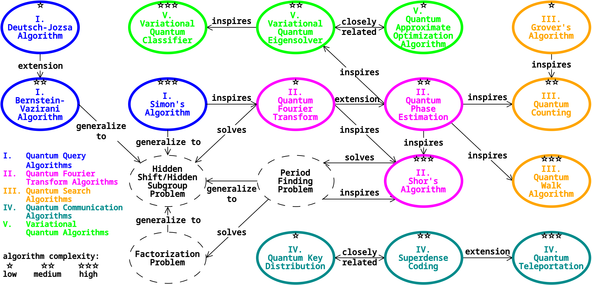

# Q-gen Quantum Circuit Generator

Please see our paper on arXiv:  

[Q-gen: A Parameterized Quantum Circuit Generator](https://arxiv.org/abs/2407.18697)

Check [```tutorial_generator.ipynb```](https://github.com/yikaimao/Q_gen/blob/main/tutorial_generator.ipynb) for generation examples.

Our [Wiki](https://github.com/yikaimao/Q_gen/wiki) page offers an overview of the simple circuits inside the Q-gen quantum circuit dataset: 

 - Circuit visualization with histogram/counts: [Circuit with histogram/counts](https://github.com/yikaimao/Q_gen/wiki#circuit-with-histogramcounts)
 - State vector simulation results: [State vectors](https://github.com/yikaimao/Q_gen/wiki#state-vectors)
 - Real measurement outputs from IBM quantum processors: [Real measurement outputs](https://github.com/yikaimao/Q_gen/wiki#real-measurement-outputs-from-ibm-quantum-processors)

The full dataset is available at [Q-gen Quantum Circuit Dataset](https://www.kaggle.com/datasets/ykmaoykmao/q-gen-quantum-circuit-dataset).

## Overview

The complete Q-gen algorithm system illustration:



The algorithm's complexity rating is designed to be compared vertically within its category instead of horizontally across different algorithm categories. To help form the connection between different algorithms, we include some generalized quantum computing problems, indicated by the dashed circles. 

The connections are gathered from various textbooks, lecture notes, and scientific papers:
 - M. A. Nielsen and I. L. Chuang, [Quantum Computation and Quantum Information: 10th Anniversary Edition](https://doi.org/10.1017/CBO9780511976667)
 - S. Aaronson, [Introduction to quantum information science lecture notes](https://www.scottaaronson.com/qclec.pdf)
 - W. van Dam, S. Hallgren, and L. Ip, [Quantum algorithms for some hidden shift problems](https://arxiv.org/abs/quant-ph/0211140)
 - A. Peruzzo, J. McClean, P. Shadbolt, M.-H. Yung, X.-Q. Zhou, P. J. Love, A. Aspuru-Guzik, and J. L. O’Brien, [A variational eigenvalue solver on a photonic quantum processor](http://dx.doi.org/10.1038/ncomms5213)
 - O. Sattath, [Stephen wiesner, my quantum thoughts](https://orsattath.wordpress.com/2021/08/14/stephen-wiesner/)

## Algorithms

| Q-gen Category                       | Algorithm                                  | Options                                       | Reference                                                                                                                                                                                                                                                                                   |
|--------------------------------------|--------------------------------------------|-----------------------------------------------|---------------------------------------------------------------------------------------------------------------------------------------------------------------------------------------------------------------------------------------------------------------------------------------------|
| Quantum Query Algorithms             | Deutsch-Jozsa Algorithm                    | ```[oracle, print_oracle]```                  | [[1]](https://github.com/Qiskit/textbook/blob/main/notebooks/ch-algorithms/deutsch-jozsa.ipynb)                                                                                                                                                                                             |
|                                      | Bernstein-Vazirani Algorithm               | ```[oracle, print_oracle]```                  | [[2]](https://github.com/Qiskit/textbook/blob/main/notebooks/ch-algorithms/bernstein-vazirani.ipynb)                                                                                                                                                                                        |
|                                      | Simon's Algorithm                          | ```[oracle, print_oracle]```                  | [[3]](https://github.com/qiskit-community/qiskit-textbook/blob/main/qiskit-textbook-src/qiskit_textbook/tools/__init__.py)                                                                                                                                                                  |
| Quantum Fourier Transform Algorithms | Quantum Fourier Transform                  | ```[initialize, inverse, measurement]```      | [[4]](https://github.com/Qiskit/textbook/blob/main/notebooks/ch-algorithms/quantum-fourier-transform.ipynb)                                                                                                                                                                                 |
|                                      | Quantum Phase Estimation                   | ```[phase_theta]```                           | [[5]](https://github.com/Qiskit/textbook/blob/main/notebooks/ch-algorithms/quantum-phase-estimation.ipynb)                                                                                                                                                                                  |
|                                      | Shor's Algorithm                           | ```[a]```                                     | [[6]](https://github.com/Qiskit/textbook/blob/main/notebooks/ch-algorithms/shor.ipynb) [[7]](https://github.com/ttlion/ShorAlgQiskit)                                                                                                                                                       |
| Quantum Search Algorithms            | Grover's Algorithm                         | ```[print_solutions]```                       | [[8]](https://github.com/Qiskit/textbook/blob/main/notebooks/ch-algorithms/grover.ipynb)                                                                                                                                                                                                    |
|                                      | Quantum Counting Algorithm                 | ```[print_oracle]```                          | [[9]](https://github.com/Qiskit/textbook/blob/main/notebooks/ch-algorithms/quantum-counting.ipynb)                                                                                                                                                                                          |
|                                      | Quantum Walk Algorithm                     | ```[print_solutions]```                       | [[10]](https://github.com/Qiskit/textbook/blob/main/notebooks/ch-algorithms/quantum-walk-search-algorithm.ipynb)                                                                                                                                                                            |
|                                      | Quantum Walk Algorithm (simple)            | ```[starting_qubit, initialization, steps]``` | [[11]](https://quantumai.google/cirq/experiments/quantum_walks)                                                                                                                                                                                                                             |
| Quantum Communication Algorithms     | Quantum Key Distribution                   | ```[interception]```                          | [[12]](https://github.com/Qiskit/textbook/blob/main/notebooks/ch-algorithms/quantum-key-distribution.ipynb)                                                                                                                                                                                 |
|                                      | Quantum Teleportation                      | ```[size]```                                  | [[13]](https://github.com/Qiskit/textbook/blob/main/notebooks/ch-algorithms/teleportation.ipynb)                                                                                                                                                                                            |
|                                      | Superdense Coding                          | ```[state]```                                 | [[14]](https://github.com/Qiskit/textbook/blob/main/notebooks/ch-algorithms/superdense-coding.ipynb)                                                                                                                                                                                        |
| Variational Quantum Algorithms       | Quantum Approximate Optimization Algorithm | ```[graph, parameters]```                     | [[15]](https://github.com/Qiskit/textbook/blob/main/notebooks/ch-applications/qaoa.ipynb)                                                                                                                                                                                                   |
|                                      | Variational Quantum Eigensolver            | ```[repeat, gates, entanglement]```           | [[16]](https://github.com/Qiskit/textbook/blob/main/notebooks/ch-applications/vqe-molecules.ipynb) [[17]](https://docs.quantum.ibm.com/api/qiskit/qiskit.circuit.library.EfficientSU2) [[18]](https://www.youtube.com/watch?v=XF0eMYKd9ks)                                                  |
|                                      | Variational Quantum Classifier             | ```[repeat_f, repeat_v, parameters]```        | [[19]](https://qiskit-community.github.io/qiskit-machine-learning/tutorials/index.html) [[20]](https://github.com/rodneyosodo/variational-quantum-classifier-on-heartattack) [[21]](https://medium.com/qiskit/building-a-quantum-variational-classifier-using-real-world-data-809c59eb17c2) |

## Dependencies

```
    networkx==3.6.1 (only needed for qaoa.py)
    numpy==2.4.2
    qiskit==2.3.0
    qiskit_aer==0.17.2
```

## Acknowledgements

We thank the community for sharing many algorithm implementations and learning resources:

 - [Qiskit](https://github.com/Qiskit/qiskit)
 - [Qiskit Textbook](https://github.com/Qiskit/textbook) (deprecated)
 - [Qiskit Algorithms](https://github.com/qiskit-community/qiskit-algorithms)
 - [Qiskit Machine Learning](https://github.com/qiskit-community/qiskit-machine-learning)
 - [ShorAlgQiskit](https://github.com/ttlion/ShorAlgQiskit) by Rui Maia and Tiago Leão

## License

[MIT License](LICENSE.txt)
